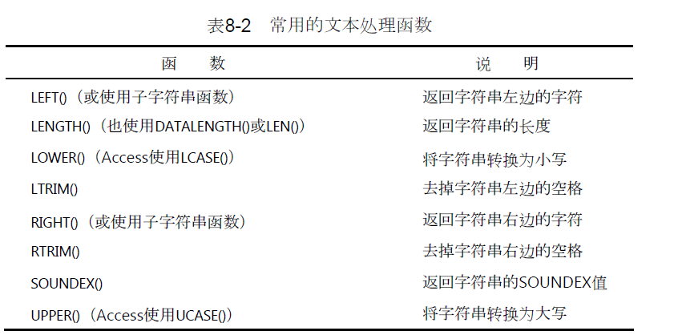
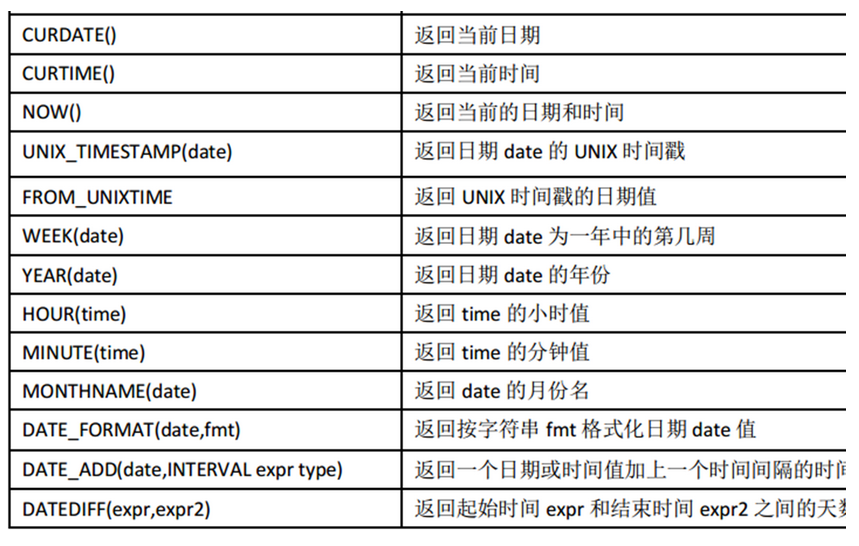
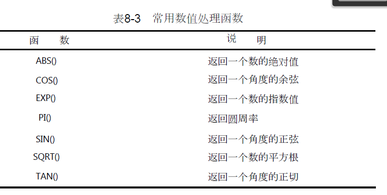

<center><font size=5 color='green'>SQL和MySQL</font ></center>
1. SQL是什么？MySQL是什么？
<p>　　SQL(Structured Query Language)结构化查询语言，SQL是一种数据库查询和程序设计语言，用于存取数据以及查询、更新和管理关系数据库系统<br>
　　MySQL是一个关系型数据库管理系统，由瑞典MySQL AB 公司开发，目前属于 Oracle 旗下产品。MySQL 是最流行的关系型数据库管理系统之一，在 WEB 应用方面，MySQL是最好的 RDBMS (Relational Database Management System，关系数据库管理系统) 应用软件。<br>
　　MySQL是一种关系数据库管理系统，关系数据库将数据保存在不同的表中，而不是将所有数据放在一个大仓库内，这样就增加了速度并提高了灵活性。<br>
　　MySQL所使用的 SQL 语言是用于访问数据库的最常用标准化语言。MySQL 软件采用了双授权政策，分为社区版和商业版，由于其体积小、速度快、总体拥有成本低，尤其是开放源码这一特点，一般中小型网站的开发都选择 MySQL 作为网站数据库。<br>
　　由于其社区版的性能卓越，搭配 PHP 和 Apache 可组成良好的开发环境。（百度百科）</p>
<center><font size=5 color='green'>查询语句</font ></center>
1. 语句解释
<p>　　SELECT XX FROM XX，所需的列名写在SELECT关键字之后，可以是*通配符，单个列名和多个列名，FROM关键字指出从哪个表
中检索数据。</p>
2. 去重语句
<p>　　SELECT DISTINCT xx FROM xx必须放在列名的前面，DISTINCT关键字作用于所有的列，不能部分使用DISTINCT</p>
3. 前N个语句
<p>　　在SQL Server和Access中使用SQL时用的是TOP关键字
SELECT TOP 5 xx FROM xx;
如果是MySQL就是SELECT xx FROM xx LIMIT 5;取出不超过5行的数据，SELECT xx FROM xx LIMIT 5 OFFSET 5;就是从第五个索引开始，往后返回5行数据，(5,6,7,8,9)，索引值是这个，但是索引从0开始</p>
4. CASE...END判断语句
<p>　　CASE WHEN THEN ELSE END，会有SELECT CASE XX when 'value' then 'replaced_value'
ELSE '其他没在when里的替代值,diserted_replaced_value' FROM table,THEN后面是返回的结果</p>
<center><font size=5 color='green'>筛选语句</font ></center>
1. 语法解释
<p>　　SELECT column1,column2 FROM  table WHERE column3=xx;
当column3等于xx的时候返回column1和column2
</p>
2. 操作符<br>

|      操作符       |        说明        |
| :---------------: | :----------------: |
|         =         |        等于        |
|        <>         |       不等于       |
|        !=         |       不等于       |
|         <         |        小于        |
|        <=         |      小于等于      |
|        !<         |       不小于       |
|        \>         |        大于        |
|        \>=        |      大于等于      |
|        !\>        |       不大于       |
| BETWEEN... AND... | 在指定的两个值之间 |
|      ISNULL       |      为NULL值      |

3.运算符
<p>　WHERE A AND(OR) B　AND操作符给WHERE语句增加条件，OR操作符A 或 B成立就返回
IN 操作符('A','B') 提供一个列表可以用OR代替不过比OR清晰
NOT 操作符对后面的表达式取反操作</p>
4.通配符
<p>　　LIKE操作符，百分号(%)通配符，表示任意字符出现任意次数，LIKE 'Fish%'就是以Fish开头的产品
LIKE '%FISH%'只要有FISH出现在文本中就行
，%不会匹配NULL，而且要注意空格<br>
　　_下划线通配符用途跟%一样，但只能匹配单个字符<br>
　　[JM]匹配中括号中的一个字符<br>
　　[!JM] 取出来不是J OR M的值
</p>
<center><font size=5 color='green'>分组语句</font ></center>
1.聚集函数
<p>　　SELECT column,COUNT(*) AS nums FROM table GROUP BY column GROUP BY子句可以包含任意数目的列，因而可以对分组进行嵌套，更细致的进行数据分析</p>
2.语句解释
<p>　　根据column分组，然后用聚集函数对每个组进行求解</p>
3.HAVING子句
<p>　　HAVING可以和WHERE类比，区别是HAVING过滤分组，WHERE过滤行。比如这个</p>

```sql

SELECT cust_id, COUNT(*) AS orders
FROM Orders
GROUP BY cust_id
HAVING COUNT(*) >= 2;

```
<center><font size=5 color='green'>排序语句</font ></center>
1.语句解释

```SQL
SELECT prod_name
FROM Products
ORDER BY prod_name;
```
<p>　　对prod_name列以字母顺序排序数据,对多个列进行排序时，只需要用逗号隔开就行，还可以对列序号进行排序，从1开始</p>
2.正序、逆序

```sql
SELECT prod_id, prod_price, prod_name
FROM Products
ORDER BY prod_price DESC;
```
<p>用DESC关键字</p>
对多个列是这样

```sql
SELECT prod_id, prod_price, prod_name
FROM Products
ORDER BY prod_price DESC, prod_name;
```
升序是ASC，但升序默认所以ASC，一般没啥用
<p>　　</p>
<center><font size=5 color='green'>函数</font ></center>
1.文本处理函数
<p>　　</img> </p>
2.时间函数
<p>　　</img></p>
3.数值函数
<p>　　</p>
项目一

```sql
SELECT Email from email GROUP BY Email HAVING count(*)>=2;
```
项目二

```sql
SELECT name,population,area 
FROM world 
WHERE area>300*10000 
OR 
(population>25000000 AND gdp>20000000)

```