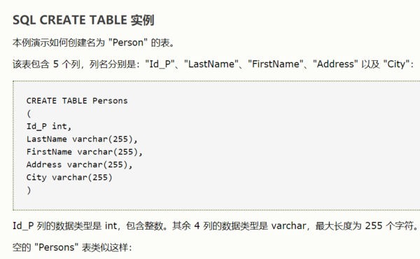

<center><font size=6 color='green'>MySQL表数据类型</font></center>

[http://www.runoob.com/mysql/mysql-data-types.html](http://www.runoob.com/mysql/mysql-data-types.html)
<center><font size=6 color='green'>用SQL语句创建表</font></center>

```auto
CREATE TABLE 语句用于创建数据库中的表。

具体用法为：

CREATE TABLE 表名称

(

列名称1 数据类型,

列名称2 数据类型,

列名称3 数据类型,

....

)

```


<center><font size=5 color='green'>用SQL语句向表中添加数据</font></center>

向表格中插入数据

SQL语言使用insert语句向数据库表格中插入或添加新的数据行。Insert语句的使用格式如下： 

insert into tablename 

(first_column,...last_column) 

values (first_value,...last_value);  

例如： 

insert into employee 

(firstname, lastname, age, address, city) 

values (‘Li’, ‘Ming’, 45, ‘No.77 Changan Road’, ‘Beijing”); 

简单来说，当向数据库表格中添加新记录时，在关键词insert into后面输入所要添加的表格名称，然后在括号中列出将要添加新值的列的名称。最后，在关键词values的后面按照前面输入的列的顺序对应的输入所有要添加的记录值。

<center><font size=5 color='green'>用SQL语句删除表</font></center>
一、SQL中的语法

   1、drop table 表名称                         eg: drop table  dbo.Sys_Test
   2、truncate table 表名称                     eg: truncate  table dbo.Sys_Test                  
   3、delete from 表名称 where 列名称 = 值      eg: delete from dbo.Sys_Test where test='test'

二、drop，truncate，delete区别

    1、drop (删除表)：删除内容和定义，释放空间。简单来说就是把整个表去掉.以后要新增数据是不可能的,除非新增一个表。

       drop语句将删除表的结构被依赖的约束（constrain),触发器（trigger)索引（index);依赖于该表的存储过程/函数将被保留，但其状态会变为：invalid。

    2、truncate (清空表中的数据)：删除内容、释放空间但不删除定义(保留表的数据结构)。与drop不同的是,只是清空表数据而已。

       注意:truncate 不能删除行数据,要删就要把表清空。

    3、delete (删除表中的数据)：delete 语句用于删除表中的行。delete语句执行删除的过程是每次从表中删除一行，并且同时将该行的删除操作作为事务记录在日志中保存

       以便进行进行回滚操作。

       truncate与不带where的delete ：只删除数据，而不删除表的结构（定义）

    4、truncate table 删除表中的所有行，但表结构及其列、约束、索引等保持不变。新行标识所用的计数值重置为该列的种子。如果想保留标识计数值，请改用delete。

       如果要删除表定义及其数据，请使用 drop table 语句。  
    5、对于由foreign key约束引用的表，不能使用truncate table ，而应使用不带where子句的delete语句。由于truncate table 记录在日志中，所以它不能激活触发器。

    6、执行速度，一般来说: drop> truncate > delete。

    7、delete语句是数据库操作语言(dml)，这个操作会放到 rollback segement 中，事务提交之后才生效；如果有相应的 trigger，执行的时候将被触发。

             truncate、drop 是数据库定义语言(ddl)，操作立即生效，原数据不放到 rollback segment 中，不能回滚，操作不触发 trigger。 
<center><font size=5 color='green'>用SQL语句修改表</font></center>

```sql
SQL脚本修改表结构 
新建表：
create table [表名]
(
[自动编号字段] int IDENTITY (1,1) PRIMARY KEY ,
[字段1] nVarChar(50) default '默认值' null ,
[字段2] ntext null ,
[字段3] datetime,
[字段4] money null ,
[字段5] int default 0,
[字段6] Decimal (12,4) default 0,
[字段7] image null ,
)
删除表：
Drop table [表名]
Truncate table [表名] --不写log 而且自增字段复位从1开始
插入数据：
INSERT INTO [表名] (字段1,字段2) VALUES (1,'ABC')
删除数据：
DELETE FROM [表名] WHERE [字段名]>100
更新数据：
UPDATE [表名] SET [字段1] = 1,[字段2] = 'ABC' WHERE [字段三] = 'what'
新增字段：
ALTER TABLE [表名] ADD [字段名] NVARCHAR (50) NULL
添加多个字段时：ALTER TABLE [表名] ADD [字段名] NVARCHAR (50) NULL，[字段名] NVARCHAR (50) NULL
如：alter table DayLog add aaa char(10), abb char(10), acc char(10), ade char(10)
删除字段：
ALTER TABLE [表名] DROP COLUMN [字段名]
修改字段：
ALTER TABLE [表名] ALTER COLUMN [字段名] NVARCHAR (50) NULL
重命名表：(Access 重命名表，请参考文章：在Access数据库中重命名表)
sp_rename '表名', '新表名', 'OBJECT'
新建约束：
ALTER TABLE [表名] ADD CONSTRAINT 约束名 CHECK ([约束字段] <= '2010-12-1')
删除约束：
ALTER TABLE [表名] DROP CONSTRAINT 约束名
如：IF  EXISTS (SELECT * FROM dbo.sysobjects WHERE id = OBJECT_ID(N'[dbo].[FK_BuiAddProType_BuildFunction]') AND type = 'F')
ALTER TABLE [dbo].[BuiAddProType] DROP CONSTRAINT [FK_BuiAddProType_BuildFunction]
GO
新建默认值
ALTER TABLE [表名] ADD CONSTRAINT 默认值名 DEFAULT 'ABC' FOR [字段名]
删除默认值
ALTER TABLE [表名] DROP CONSTRAINT 默认值名
```

任务一
```sql
SELECT class
FROM courses 
GROUP BY class
HAVING COUNT(*)>=5;
```

任务二

```sql
UPDATE salary
SET sex=
CASE
    WHEN sex='f' THEN sex='m'
    ELSE sex='f'
END;
```
